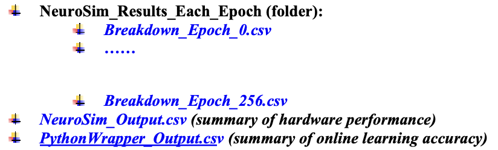

# DNN+NeuroSim
This repository contains code and steps to simulate the performance of an in-memory computing hardware accelerator using DNN+NeuroSim framework.

**What is DNN+NeuroSim?**\
DNN+NeuroSim is an integrated framework, which is developed in C++ and wrapped by Python to emulate the deep neural networks (DNN) performance, both for on-chip training and inference on the hardware accelerator based on in-memory computing architectures.

## System Requirements
The tool requires a Linux environment with system dependencies installed. Below are few tested environments that work,

1. Red Hat 5.11 (Tikanga), gcc v4.7.2, glibc 2.5,  (or)
2. Red Hat 7.3 (Maipo), gcc v4.8.5, glibc v2.1.7,  (or)
3. Ubuntu 16.04, gcc v5.4.0, glibc v2.23

On other linux environments tool requires gcc >= 4.5 for error free compilation.

To run the python wrapper, tool also requires a conda or python environment with an installation of PyTorch.
```
conda install pytorch==2.0.1 torchvision==0.15.2 torchaudio==2.0.2 pytorch-cuda=11.7 -c pytorch -c nvidia
```
or
```
pip install torch==2.0.1 torchvision==0.15.2 torchaudio==2.0.2
```

## Installation
Get the tool from github
```
git clone https://github.com/In-Memory-Computing/DNN_NeuroSim.git
```
The tool can also be cloned from original repository
```
git clone https://github.com/neurosim/DNN_NeuroSim_V2.1.git
```

## Execution Steps
1. Set up hardware parameters in NeuroSim Core (*./NeuroSIM/Param.cpp*) and compile the Code.
   ```
   make
   ```
2. Define the network structure in Network.csv file. (*./NeuroSIM/Network.csv*). Example: VGG8(Default)
   
3. Set up hardware constraints in Python wrapper (train.py)   

4. Run Pytorch wrapper integrated with NeuroSim (for online-training performance)
   ```
   python train.py
   ```
   For inference, set the 'model_path' variable inside inference.py file to the most recent trained weights file and run the wrapper.
   ```
   python inference.py
   ```
## Hardware Parameters
User defined hardware parameters from 'Param.cpp' file.

- Operation mode can be selected between sequential and parallel
  ```
  operationmode = 2;    // 1: conventionalSequential
                        // 2: conventionalParallel 
  ```
- Memory cell types vary between SRAM, RRAM, FeFET
  ```
  memcelltype = 3;         // 1: cell.memCellType = Type::SRAM
                           // 2: cell.memCellType = Type::RRAM
                           // 3: cell.memCellType = Type::FeFET
  ```
- Buffer size
  ```
  globalBufferType = false;    // false: register file
                               // true: SRAM
  globalBufferCoreSizeRow = 128;
  globalBufferCoreSizeCol = 128;
	
  tileBufferType = false;      // false: register file
                               // true: SRAM
  tileBufferCoreSizeRow = 32;
  tileBufferCoreSizeCol = 32;
  ```
- Weight mapping types
- ADC variants
- Technology node and wire width
- Sub array size
- SRAM parameters
- Parameters for analog synaptic devices
- Design options for on-chip training

## Results
- The recent model weights (from training) can be found in 'latest.pth' file under log directory (*./log/default/ADCprecision=5/.../latest.pth*)
- Hardware performance for each epoch is captured under *./NeuroSim_Results_Each_Epoch* folder
  
- Also the layer-wise cumulative training performance is displayed on the screen as well as under the log folder (*./log/default/ADCprecision=5/.../ \*.log*)
  
     ```
      ------------------------------ FloorPlan --------------------------------
      Tile and PE size are optimized to maximize memory utilization ( = memory mapped by synapse / total memory on chip)
      
      Desired Conventional Mapped Tile Storage Size: 1024x1024
      Desired Conventional PE Storage Size: 512x512
      Desired Novel Mapped Tile Storage Size: 9x512x512
      User-defined SubArray Size: 128x128
      
      ----------------- # of tile used for each layer -----------------
      layer1: 1
      layer2: 1
      layer3: 1
      layer4: 1
      layer5: 1
      layer6: 1
      layer7: 8
      layer8: 1
      
      ----------------- Speed-up of each layer ------------------
      layer1: 64
      layer2: 16
      layer3: 8
      layer4: 4
      layer5: 2
      layer6: 1
      layer7: 1
      layer8: 8
      
      ----------------- Utilization of each layer ------------------
      layer1: 0.210938
      layer2: 1
      layer3: 1
      layer4: 1
      layer5: 1
      layer6: 1
      layer7: 1
      layer8: 0.078125
      Memory Utilization of Whole Chip: 88.5938 % 
      
      -------------------------------------- Hardware Performance --------------------------------------
      -------------------- Estimation of Layer 1 ----------------------
      layer1's readLatency of Forward is: 7.96138e+09ns
      layer1's readDynamicEnergy of Forward is: 7.27733e+10pJ
      layer1's readLatency of Activation Gradient is: 0ns
      layer1's readDynamicEnergy of Activation Gradient is: 0pJ
      layer1's readLatency of Weight Gradient is: 1.81752e+09ns
      layer1's readDynamicEnergy of Weight Gradient is: 1.11504e+11pJ
      layer1's writeLatency of Weight Update is: 1.02029e+06ns
      layer1's writeDynamicEnergy of Weight Update is: 4.38783e+06pJ
      ~~~~~~~~~~~~~~~~~~~~~~~~~~~~~~~~~~~~~~~~~~~~~~~~~~~~~~~~~~~
      layer1's PEAK readLatency of Forward is: 1.15933e+08ns
      layer1's PEAK readDynamicEnergy of Forward is: 1.83274e+10pJ
      layer1's PEAK readLatency of Activation Gradient is: 0ns
      layer1's PEAK readDynamicEnergy of Activation Gradient is: 0pJ
      layer1's PEAK readLatency of Weight Gradient is: 1.23285e+09ns
      layer1's PEAK readDynamicEnergy of Weight Gradient is: 8.76581e+10pJ
      layer1's PEAK writeLatency of Weight Update is: 1.01325e+06ns
      layer1's PEAK writeDynamicEnergy of Weight Update is: 4.29834e+06pJ
      ~~~~~~~~~~~~~~~~~~~~~~~~~~~~~~~~~~~~~~~~~~~~~~~~~~~~~~~~~~~
      layer1's leakagePower is: 4.42057uW
      layer1's leakageEnergy is: 4.92714e+08pJ
      
      ************************ Breakdown of Latency and Dynamic Energy *************************
      
      ----------- ADC (or S/As and precharger for SRAM) readLatency is : 6.78312e+07ns
      ----------- Accumulation Circuits (subarray level: adders, shiftAdds; PE/Tile/Global level: accumulation units) readLatency is : 7.33546e+06ns
      ----------- Synaptic Array w/o ADC (Forward + Activate Gradient) readLatency is : 4.07669e+07ns
      ----------- Buffer buffer latency is: 6.87397e+09ns
      ----------- Interconnect latency is: 1.56697e+09ns
      ----------- Weight Gradient Calculation readLatency is : 1.23285e+09ns
      ----------- Weight Update writeLatency is : 1.01325e+06ns
      ----------- DRAM data transfer Latency is : 987789ns
      ~~~~~~~~~~~~~~~~~~~~~~~~~~~~~~~~~~~~~~~~~~~~~~
      ----------- ADC (or S/As and precharger for SRAM) readDynamicEnergy is : 1.34947e+10pJ
      ----------- Accumulation Circuits (subarray level: adders, shiftAdds; PE/Tile/Global level: accumulation units) readDynamicEnergy is : 3.48139e+09pJ
      ----------- Synaptic Array w/o ADC (Forward + Activate Gradient) readDynamicEnergy is : 1.35132e+09pJ
      ----------- Buffer readDynamicEnergy is: 1.62304e+09pJ
      ----------- Interconnect readDynamicEnergy is: 5.00789e+10pJ
      ----------- Weight Gradient Calculation readDynamicEnergy is : 8.76581e+10pJ
      ----------- Weight Update writeDynamicEnergy is : 4.29834e+06pJ
      ----------- DRAM data transfer Energy is : 5.85562e+10pJ
  ```
- Similarly the inference performance can be found under the log directory((*./log/default/ADCprecision=6/.../ \*.log*)
  
  ```
      ------------------------------ Summary --------------------------------
      
      ChipArea : 1.53632e+08um^2
      Chip total CIM (Forward+Activation Gradient) array : 579821um^2
      Total IC Area on chip (Global and Tile/PE local): 2.56408e+07um^2
      Total ADC (or S/As and precharger for SRAM) Area on chip : 8.57996e+07um^2
      Total Accumulation Circuits (subarray level: adders, shiftAdds; PE/Tile/Global level: accumulation units) on chip : 1.9617e+07um^2
      Other Peripheries (e.g. decoders, mux, switchmatrix, buffers, pooling and activation units) : 1.19747e+07um^2
      Weight Gradient Calculation : 1.00204e+07um^2
      
      -----------------------------------Chip layer-by-layer Estimation---------------------------------
      Chip readLatency of Forward (per epoch) is: 5.86574e+10ns
      Chip readDynamicEnergy of Forward (per epoch) is: 2.11076e+12pJ
      Chip readLatency of Activation Gradient (per epoch) is: 4.82671e+10ns
      Chip readDynamicEnergy of Activation Gradient (per epoch) is: 2.01116e+12pJ
      Chip readLatency of Weight Gradient (per epoch) is: 5.54596e+10ns
      Chip readDynamicEnergy of Weight Gradient (per epoch) is: 8.53984e+13pJ
      Chip writeLatency of Weight Update (per epoch) is: 5.37681e+07ns
      Chip writeDynamicEnergy of Weight Update (per epoch) is: 9.12659e+08pJ
      ~~~~~~~~~~~~~~~~~~~~~~~~~~~~~~~~~~~~~~~~~~~~~~~~~~~~
      Chip total Latency (per epoch) is: 1.62438e+11ns
      Chip total Energy (per epoch) is: 8.95213e+13pJ
      ~~~~~~~~~~~~~~~~~~~~~~~~~~~~~~~~~~~~~~~~~~~~~~~~~~~~
      Chip PEAK readLatency of Forward (per epoch) is: 6.13371e+09ns
      Chip PEAK readDynamicEnergy of Forward (per epoch) is: 1.10523e+12pJ
      Chip PEAK readLatency of Activation Gradient (per epoch) is: 6.28138e+09ns
      Chip PEAK readDynamicEnergy of Activation Gradient (per epoch) is: 1.08421e+12pJ
      Chip PEAK readLatency of Weight Gradient (per epoch) is: 3.47169e+10ns
      Chip PEAK readDynamicEnergy of Weight Gradient (per epoch) is: 9.35463e+12pJ
      Chip PEAK writeLatency of Weight Update (per epoch) is: 0ns
      Chip PEAK writeDynamicEnergy of Weight Update (per epoch) is: 1.10802e+06pJ
      ~~~~~~~~~~~~~~~~~~~~~~~~~~~~~~~~~~~~~~~~~~~~~~~~~~~~
      Chip PEAK total Latency (per epoch) is: 4.7132e+10ns
      Chip PEAK total Energy (per epoch) is: 1.15441e+13pJ
      ~~~~~~~~~~~~~~~~~~~~~~~~~~~~~~~~~~~~~~~~~~~~~~~~~~~~
      Chip leakage Energy is: 5.6773e+10pJ
      Chip leakage Power is: 370.764uW
      
      ************************ Breakdown of Latency and Dynamic Energy *************************
      
      ----------- ADC (or S/As and precharger for SRAM) readLatency is : 3.12677e+09ns
      ----------- Accumulation Circuits (subarray level: adders, shiftAdds; PE/Tile/Global level: accumulation units) readLatency is : 7.62888e+09ns
      ----------- Synaptic Array w/o ADC (Forward + Activate Gradient) readLatency is : 1.65943e+09ns
      ----------- Buffer readLatency is: 7.56142e+10ns
      ----------- Interconnect readLatency is: 6.09784e+10ns
      ----------- Weight Gradient Calculation readLatency is : 3.47169e+10ns
      ----------- Weight Update writeLatency is : 0ns
      ----------- DRAM data transfer Latency is : 1.2825e+09ns
      ~~~~~~~~~~~~~~~~~~~~~~~~~~~~~~~~~~~~~~~~~~~~~~
      ----------- ADC (or S/As and precharger for SRAM) readDynamicEnergy is : 1.44076e+12pJ
      ----------- Accumulation Circuits (subarray level: adders, shiftAdds; PE/Tile/Global level: accumulation units) readDynamicEnergy is : 6.18395e+11pJ
      ----------- Synaptic Array w/o ADC (Forward + Activate Gradient) readDynamicEnergy is : 1.30278e+11pJ
      ----------- Buffer readDynamicEnergy is: 1.98738e+11pJ
      ----------- Interconnect readDynamicEnergy is: 2.04319e+12pJ
      ----------- Weight Gradient Calculation readDynamicEnergy is : 9.35463e+12pJ
      ----------- Weight Update writeDynamicEnergy is : 1.10802e+06pJ
      ----------- DRAM data transfer DynamicEnergy is : 7.60265e+13pJ
      
      ************************ Breakdown of Latency and Dynamic Energy *************************
      
      
      -----------------------------------Chip layer-by-layer Performance---------------------------------
      Energy Efficiency TOPS/W: 2.05878
      Throughput TOPS: 1.13534
      Throughput FPS: 0.00615621
      --------------------------------------------------------------------------
      Peak Energy Efficiency TOPS/W: 15.9754
      Peak Throughput TOPS: 3.91287
      Peak Throughput FPS: 0.021217
   ```

## References
- X. Peng, S. Huang, Y. Luo, X. Sun and S. Yu, " DNN+NeuroSim: An end-to-end benchmarking framework for compute-in-memory accelerators with versatile device technologies," IEEE International Electron Devices Meeting (IEDM), 2019.
- X. Peng, S. Huang, H. Jiang, A. Lu and S. Yu, “DNN+ NeuroSim V2.0: An End-to-End Benchmarking Framework for Compute-in-Memory Accelerators for Training,” arXiv, 2020. 
- S. Wu, et al. "Training and inference with integers in deep neural networks," arXiv: 1802.04680, 2018. 
- A. Lu, X. Peng, W. Li, H. Jiang, A. Lu and S. Yu, “NeuroSim Simulator for Compute-in-Memory Hardware Accelerator: Validation and Benchmark,” IEEE, 2021. 
- Repository:
  https://github.com/neurosim/DNN_NeuroSim_V2.1
- Installation Tutorial:
  https://www.youtube.com/watch?v=pdT9NCn1L44&t=735s
- User Manual:
  https://github.com/neurosim/DNN_NeuroSim_V2.1/blob/master/Documents/DNN%20NeuroSim%20V2.1%20User%20Manual.pdf

